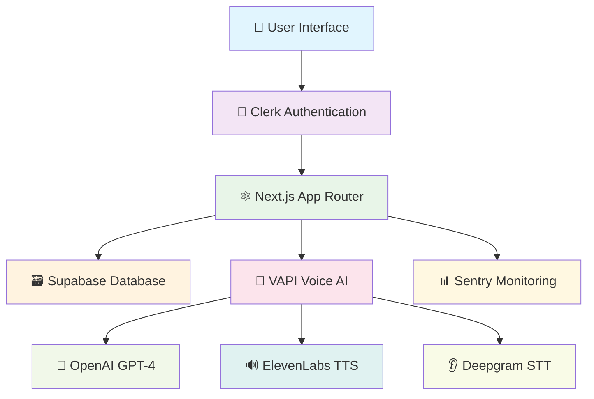
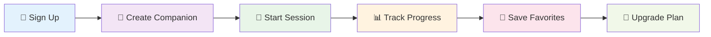

<div align="center">

# 🎓 Converso
### AI-Powered Real-Time Voice Learning Platform

*Revolutionizing personalized education through intelligent voice companions*

[](https://nextjs.org/)
[](https://www.typescriptlang.org/)
[](https://reactjs.org/)
[](https://supabase.com/)
[](https://openai.com/)


</div>

---

## 🎯 Project Overview

**Converso** is a next-generation SaaS educational platform that transforms traditional learning through AI-powered voice companions. Users create personalized AI tutors for interactive, real-time voice-based learning sessions across multiple academic subjects.

<div align="center">

### ✨ Key Features

</div>

<table>
<tr>
<td width="50%">

#### 🤖 **AI Companion Builder**
- Custom AI tutor creation
- Subject-specific configurations
- Personalized learning paths
- Voice & style customization

#### 📚 **Multi-Subject Learning**  
- Mathematics & Science
- Language Arts & History
- Computer Programming
- Economics & Business

</td>
<td width="50%">

#### 🎤 **Real-Time Voice AI**
- Live voice conversations
- Advanced speech synthesis
- Natural language processing
- Interactive transcription

#### 📊 **Progress Analytics**
- Session history tracking
- Learning journey insights
- Performance metrics
- Bookmark management

</td>
</tr>
</table>

---

## �️ Technology Stack

<div align="center">

### Frontend Technologies


### Backend & Database


### AI & Voice Technologies


### Development Tools


</div>

<table>
<tr>
<td width="33%">

#### 🎨 **Frontend**
- **Next.js 15.3.2** - Full-stack React framework
- **React 19** - Latest with concurrent features  
- **TypeScript** - Type-safe development
- **Tailwind CSS 4** - Utility-first styling
- **Radix UI** - Accessible components
- **Lottie React** - Interactive animations

</td>
<td width="33%">

#### 🔧 **Backend**
- **Supabase** - PostgreSQL + Real-time
- **Clerk Auth** - User management
- **Server Actions** - Secure API operations
- **WebRTC** - Real-time communication
- **Row Level Security** - Data protection

</td>
<td width="33%">

#### 🤖 **AI Integration**
- **OpenAI GPT-4** - Language model
- **VAPI AI** - Voice conversation platform
- **ElevenLabs** - Text-to-speech synthesis
- **Deepgram Nova-3** - Speech recognition
- **Real-time Transcription** - Live captions

</td>
</tr>
</table>

---

## 🏗️ System Architecture

<div align="center">



</div>

### 🔄 Application Flow

<table>
<tr>
<td width="20%" align="center">

#### 1️⃣ **Authentication**


Secure sign-in/sign-up with social providers

</td>
<td width="20%" align="center">

#### 2️⃣ **Companion Builder**


Custom AI tutor creation with subject & voice selection

</td>
<td width="20%" align="center">

#### 3️⃣ **Voice Session**


WebRTC-powered live conversations with AI

</td>
<td width="20%" align="center">

#### 4️⃣ **Progress Tracking**


Automatic session history & learning insights

</td>
<td width="20%" align="center">

#### 5️⃣ **Subscription**


Tiered access control & feature management

</td>
</tr>
</table>

### 🗄️ Database Schema

<table>
<tr>
<td width="25%" align="center">

#### 🤖 **Companions**
```sql
├── id (uuid)
├── name (text)
├── subject (enum)
├── topic (text)
├── voice (text)
├── style (text)
├── duration (int)
└── author (text)
```

</td>
<td width="25%" align="center">

#### 📈 **Session History**
```sql
├── id (uuid)
├── user_id (text)
├── companion_id (uuid)
├── created_at (timestamp)
└── session_data (jsonb)
```

</td>
<td width="25%" align="center">

#### 🔖 **Bookmarks**
```sql
├── id (uuid)
├── user_id (text)
├── companion_id (uuid)
└── created_at (timestamp)
```

</td>
<td width="25%" align="center">

#### 👤 **Users**
```sql
Managed by Clerk:
├── user_id (text)
├── email (text)
├── name (text)
└── subscription (text)
```

</td>
</tr>
</table>

### 🎙️ Real-Time Communication

<div align="center">

**WebRTC + AI Pipeline**

</div>

```
👤 User Speech → 🎤 Microphone → 📡 WebRTC → 👂 Deepgram STT → 🧠 GPT-4 Processing → 🔊 ElevenLabs TTS → 📡 WebRTC → 🔈 Speaker → 👤 User
                                     ↓
                               📝 Real-time Transcription Display
```

**Key Capabilities:**
- 🔄 **Bidirectional Audio Streaming** - Ultra-low latency communication
- 🗣️ **Real-Time Speech Recognition** - Instant voice-to-text conversion  
- 🧠 **Context-Aware AI Responses** - GPT-4 powered intelligent conversations
- 📝 **Live Transcription** - Real-time conversation history display
- 🎛️ **Interactive Controls** - Mute/unmute, session management

---

## 💡 Technical Innovations

<div align="center">

### 🚀 **Advanced Capabilities**

</div>

<table>
<tr>
<td width="33%">

#### 🎯 **AI Integration**


- **GPT-4 + Voice Synthesis** Integration
- **Context-Aware Learning** Adaptation  
- **Dynamic Voice Configuration**
- **Real-time Response Generation**

</td>
<td width="33%">

#### ⚡ **Performance**


- **Server-Side Rendering** (Next.js)
- **Intelligent Database** Caching
- **Real-time Subscriptions** (Supabase)
- **Type-Safe Development** (TypeScript)

</td>
<td width="33%">

#### 🎨 **User Experience**  


- **Mobile-First** Responsive Design
- **Accessibility** Standards (WCAG)
- **Progressive Enhancement**
- **Cross-Platform** Compatibility

</td>
</tr>
</table>

<div align="center">

### 🔥 **Key Technical Highlights**

</div>

```typescript
// Real-time Voice AI Integration
const handleVoiceSession = async () => {
  const assistant = configureAssistant(voice, style);
  const overrides = {
    variableValues: { subject, topic, style },
    clientMessages: ["transcript"],
  };
  
  vapi.start(assistant, overrides); // WebRTC connection established
};

// Type-safe Database Operations  
const companions = await getAllCompanionsWithBookmarkStatus({
  subject: filters.subject,
  topic: filters.topic
});

// Real-time UI Updates
useEffect(() => {
  vapi.on('speech-start', () => setIsSpeaking(true));
  vapi.on('message', handleTranscript);
}, []);
```

---

## 🎨 Design System

<div align="center">

### 🎯 **Modern Educational Interface**

</div>

<table>
<tr>
<td width="50%">

#### 🎨 **Visual Design**
- 🌈 **Subject Color Coding** - Visual organization by academic subjects
- ✨ **Interactive Animations** - Lottie-powered voice interaction feedback
- 📝 **Typography** - Bricolage Grotesque for enhanced readability  
- 📱 **Responsive Layout** - Mobile-first adaptive design

</td>
<td width="50%">

#### 🧩 **Component Architecture**
- 🔧 **Radix UI Foundation** - Accessible component primitives
- 🎭 **Design Tokens** - Consistent styling variables
- 🔄 **Reusable Components** - Modular UI building blocks
- 🎯 **Design System** - Unified visual language

</td>
</tr>
</table>

<div align="center">

**Color Palette**


</div>

---

## 📊 Core Features & Business Logic

<div align="center">

### 🎯 **Feature Matrix**

</div>

<table>
<tr>
<td width="33%" align="center">

#### 💎 **Subscription Tiers**


**Free Tier**
- ✅ 3 AI Companions
- ✅ Basic Voice Options
- ✅ Session History

**Pro Tier**
- ✅ Unlimited Companions
- ✅ Premium Voices
- ✅ Advanced Analytics
- ✅ Priority Support

</td>
<td width="33%" align="center">

#### 📈 **Learning Analytics**  


- 📊 **Session Tracking**
- 📈 **Progress Visualization**  
- 🎯 **Performance Metrics**
- 🏆 **Achievement System**
- 📋 **Learning Reports**

</td>
<td width="33%" align="center">

#### 🎛️ **Content Management**


- 🔍 **Dynamic Search & Filter**
- 🔖 **Bookmark System**
- ⏱️ **Recent Activity**
- 📚 **Companion Library**
- 👤 **Personal Dashboard**

</td>
</tr>
</table>

### 🔄 **User Journey Flow**



---

## 🔐 Security & Performance

<div align="center">

### 🛡️ **Enterprise-Grade Security**

</div>

<table>
<tr>
<td width="50%">

#### 🔒 **Security Measures**


- 🔐 **Clerk Authentication** - Social & MFA support
- 🛡️ **Row Level Security** - Database-level protection
- 📊 **Sentry Monitoring** - Real-time error tracking
- ✅ **Zod Validation** - Input sanitization & validation
- 🔒 **JWT Tokens** - Secure session management

</td>
<td width="50%">

#### ⚡ **Performance Optimization**


- 📦 **Code Splitting** - Automatic bundle optimization
- 🖼️ **Image Optimization** - Next.js optimized assets
- 💾 **Smart Caching** - Multi-layer caching strategy
- 🔄 **Real-time Sync** - Live data synchronization
- 📱 **Mobile Optimization** - Responsive performance

</td>
</tr>
</table>

---

<div align="center">

## 🚀 **Project Showcase**

### *Full-Stack AI SaaS Platform*

**This project demonstrates mastery of:**


**🎯 Combines cutting-edge technologies into a cohesive educational platform**  
**🚀 Solves real-world learning challenges through innovative AI solutions**  
**💼 Built with enterprise-grade security and scalability in mind**

---

### 📞 **Connect & Collaborate**

[](https://linkedin.com)
[](https://github.com)
[](https://portfolio.com)
[](mailto:contact@example.com)

**Built with ❤️ for the future of education**

</div>
